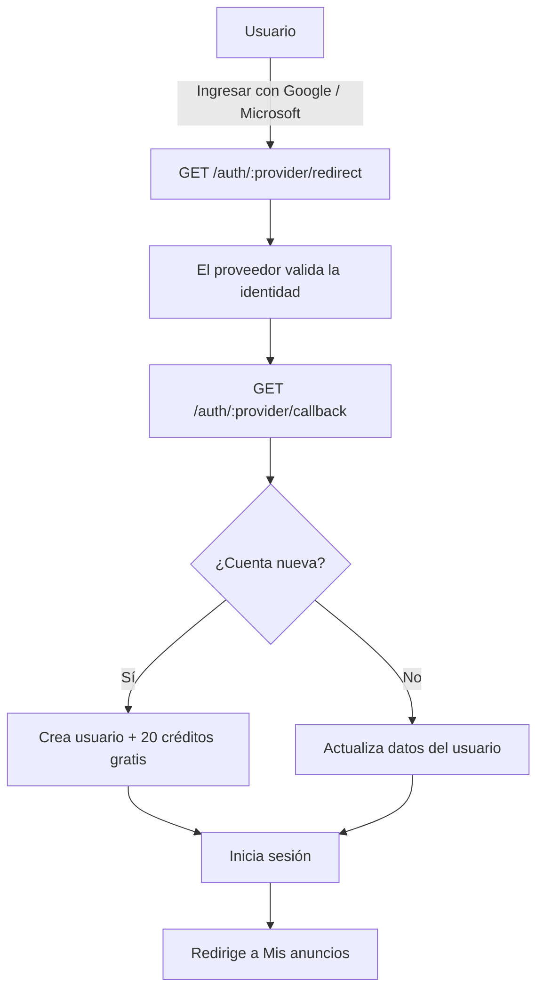
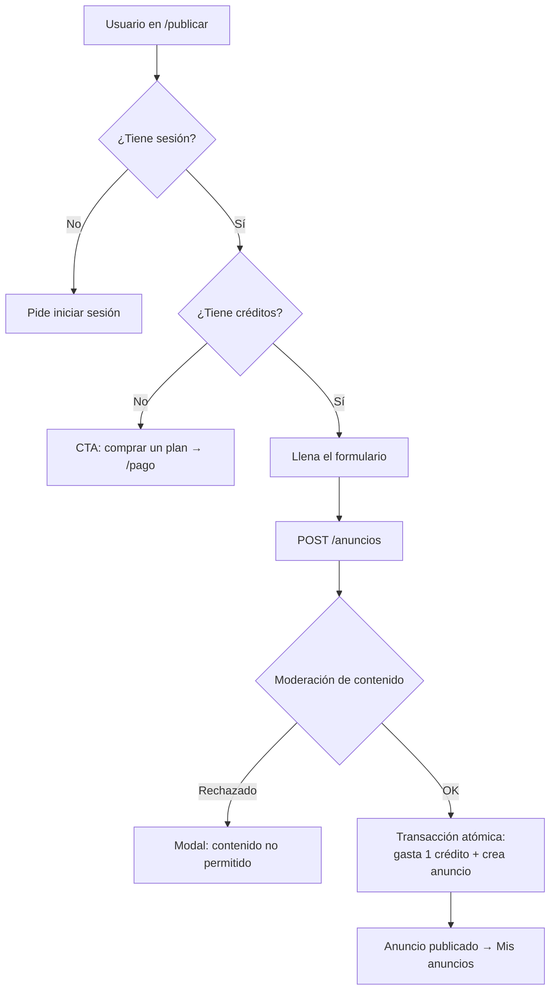
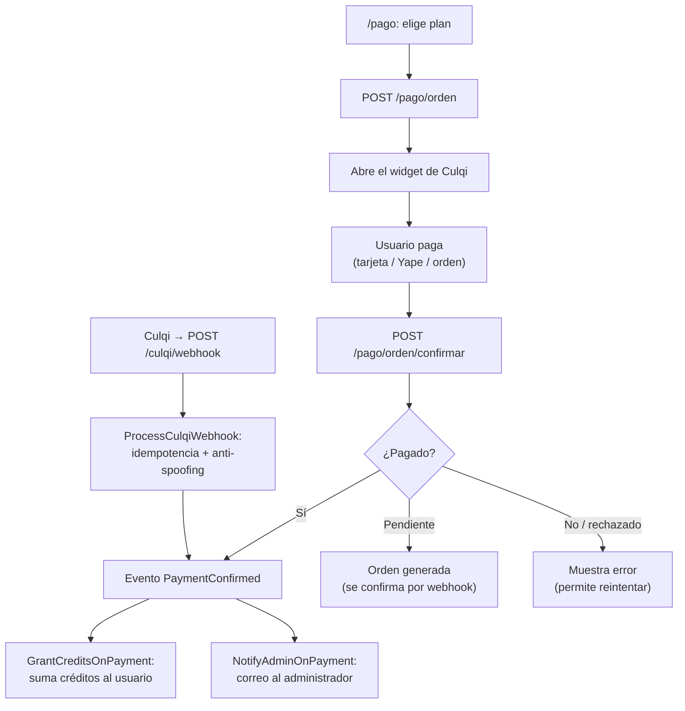
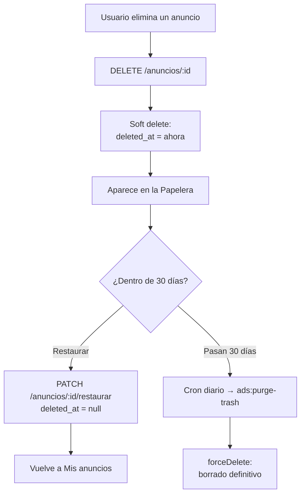
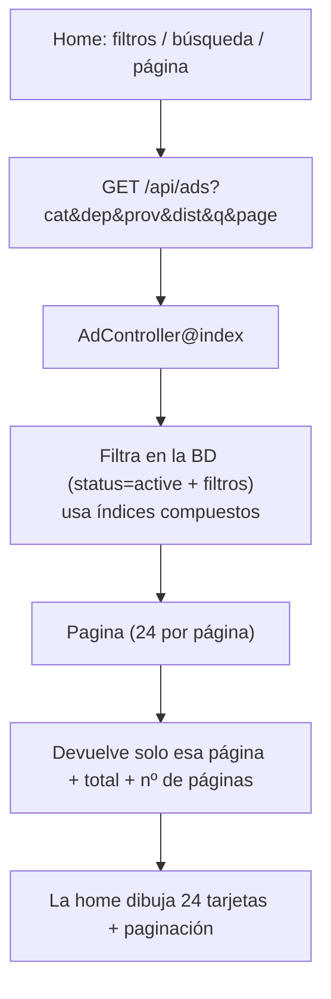

# 🔁 Diagramas de flujo — anuncialo.pe

> Diagramas en **Mermaid**. Se renderizan automáticamente al abrir este archivo en
> **GitHub**. También puedes verlos/editarlos en [mermaid.live](https://mermaid.live)
> o en VS Code con la extensión _Markdown Preview Mermaid Support_.

---

## 1. Registro / Login (OAuth)

---

## 2. Publicar un anuncio

---

## 3. Compra de créditos (pago con Culqi)

---

## 4. Eliminar y Papelera (soft delete)

---

## 5. Listado público (paginado en el servidor)

